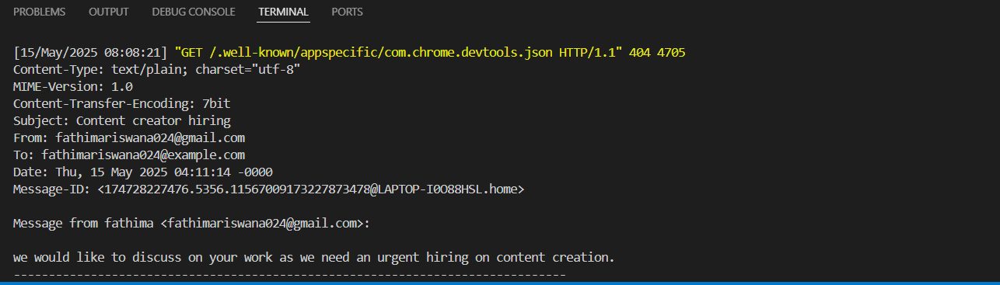

# TechBlog - A Django Blog Platform with CKEditor Integration

TechBlog is a simple blog platform built with Django, featuring a rich text editor using CKEditor. It allows users to create, edit, and view blog posts with formatted content and media uploads.

## 🚀 Features

- Create, edit, and delete blog posts through admin panel
- Rich text editing with CKEditor (image uploads supported)
- Categories or tags for posts 
- Responsive frontend using Django templates
- Admin panel for managing content

## 🛠️ Tech Stack

- Python 3.x
- Django 4.x
- CKEditor (django-ckeditor)
- SQLite 
- HTML, CSS, Bootstrap (for frontend)

## 📸 Screenshots
-  Home page of the website


-  Blog list page of the website


## 📂 Project Structure

```bash
TechBlog/
├── blog/              # Main blog app
├── TechBlog/          # Project settings
├── media/             # Uploaded images
├── static/            # Static files (CSS, JS)
├── templates/         # HTML templates
├── manage.py
└── requirements.txt

## Additional information
incorporated send message provision as a dummy and printing the conetnt on termina


when we click on Send Message button the below get printed in terminal as just added for testing

